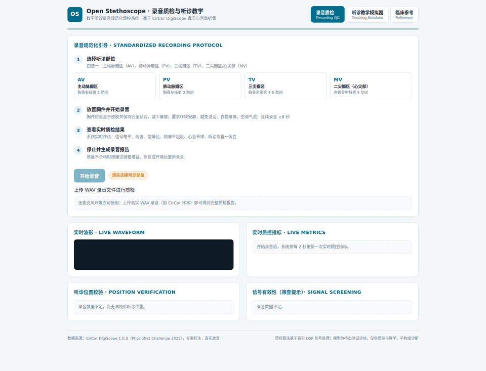
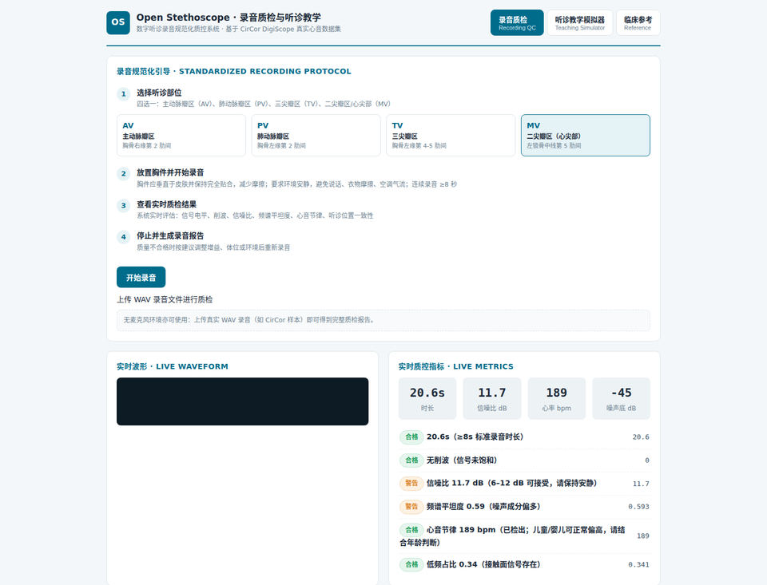
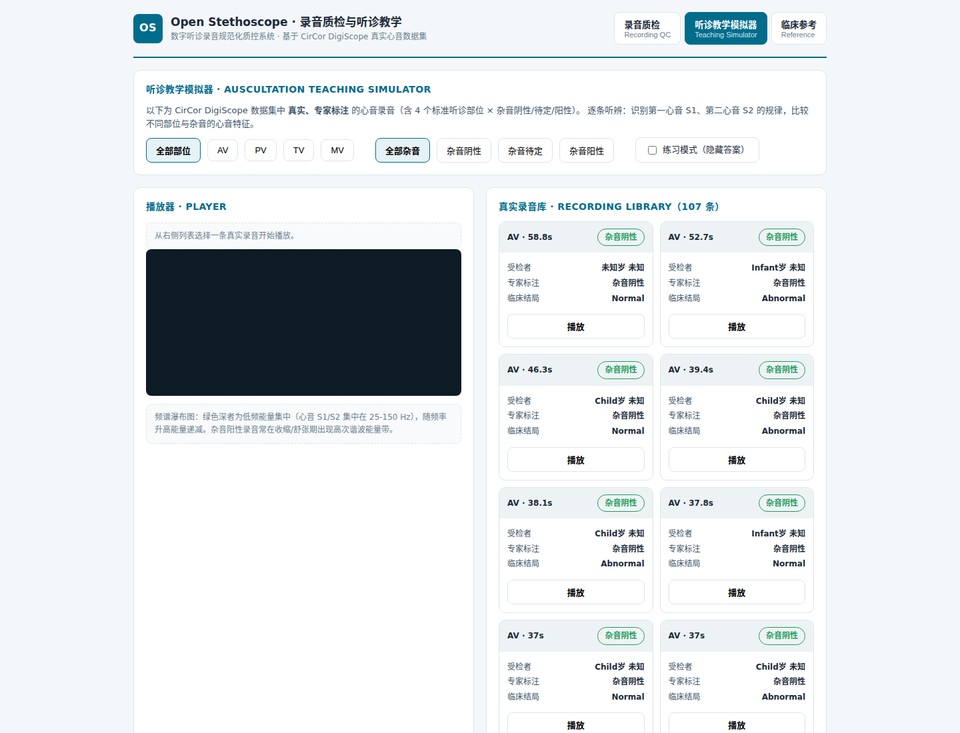
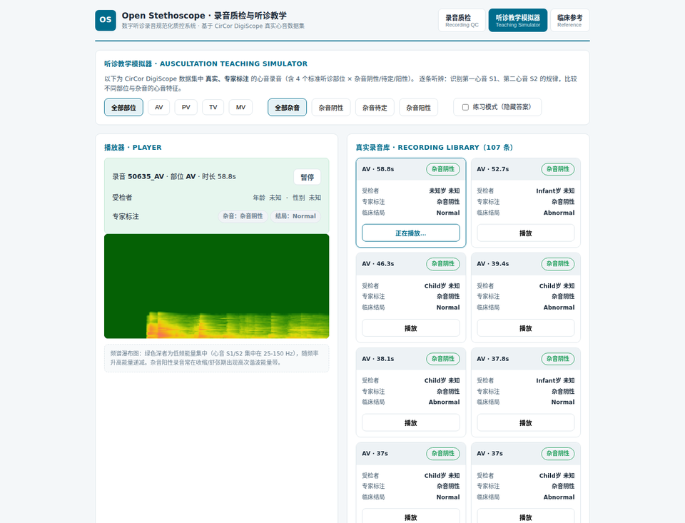
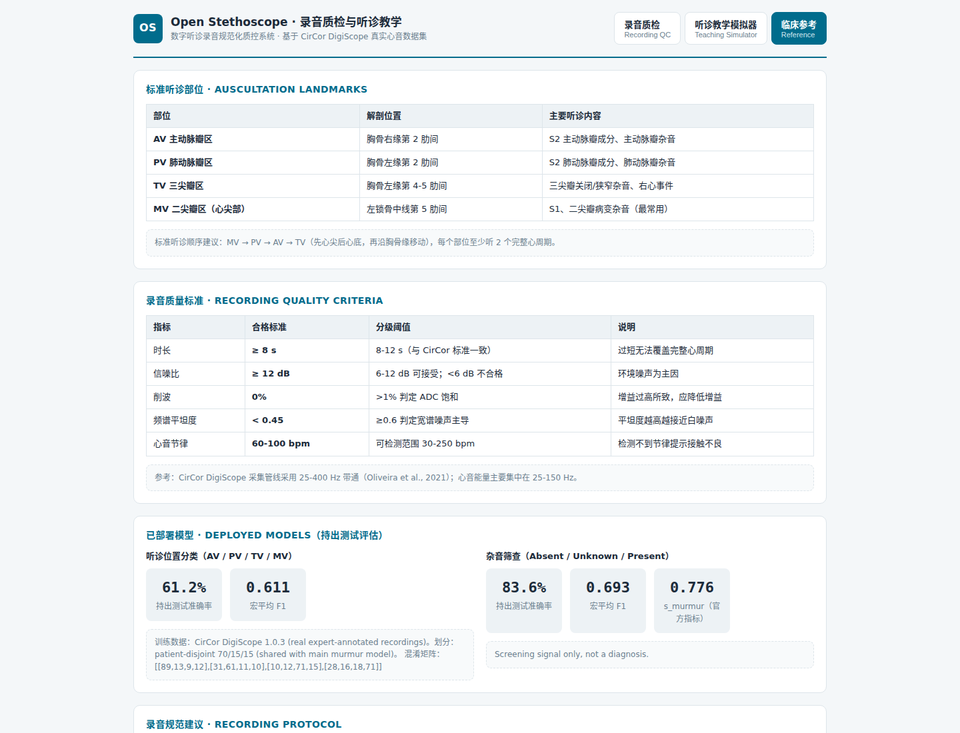

# Open Stethoscope 🩺

**Open-source AI heart murmur detection for primary care.**

Cardiovascular disease is the leading cause of death in China. In county and township health centers, general practitioners often lack the training to interpret heart sounds. Open Stethoscope brings cardiology-grade auscultation to every village doctor — for free, open source, and on-device.

## Why

- CVD is the #1 cause of death in China and worldwide
- ~1.2 million heart sound recordings are needed at grassroots level each year, but there aren't enough cardiologists to read them
- Digital stethoscopes + AI can screen for heart murmurs (valvular disease) with accuracy approaching specialist auscultation
- Existing solutions are closed-source and enterprise-priced — this project is open and runs on edge hardware

## What

A deep learning system for heart murmur detection from phonocardiogram (PCG) recordings, built on the [CirCor DigiScope dataset](https://physionet.org/content/circor-heart-sound/) (PhysioNet Challenge 2022):

- **5,272 recordings** from **1,568 patients**, expert-annotated for murmurs
- **~400K parameters**, <1 GB VRAM, real-time CPU inference — designed for low-cost edge devices (Tesla P4 / CPU)
- Reproducible baseline with strict patient-disjoint evaluation and the official Challenge metric

## Approach

- **Multi-location attention fusion** — one patient = one sample. All available auscultation positions (AV/PV/TV/MV) are encoded by a shared 2D-CNN over log-mel spectrograms, then fused with a **masked learned attention** (missing positions masked out). Mirrors how a clinician listens to all positions before judging.
- **Class-imbalance handling** — sqrt-inverse-frequency patient sampling + class-weighted CE + auxiliary "murmur present?" binary head (λ=0.3).
- **Mel-domain augmentation** — random 8 s window, ±10% time stretch, SpecAugment-lite, Gaussian noise.
- **Patient-stratified evaluation** — strict patient-disjoint 70/15/15 train/val/test split (no leakage).

## Results

Held-out test set (142 patients, never seen during training), official CirCor-2022 challenge metric `s_murmur` (weights Absent:1 / Unknown:3 / Present:5):

**v4 (current best) — test s_murmur 0.7815, beats the 2022 Challenge champion (0.780):**

| Model | Test acc | Test macro-F1 | Test s_murmur | recall A / U / P |
|-------|---------|---------------|---------------|------------------|
| **v4 L_s43_30ep + val-tuned thresholds** | **0.8380** | 0.7177 | **0.7815** | 0.886 / 0.600 / 0.741 |
| v4 L2_s43_smur (s_murmur early-stop, untuned) | 0.7817 | — | **0.7815** | 0.790 / 0.600 / 0.815 |
| **v4 4-model ensemble (tuned)** | 0.7958 | 0.7055 | **0.7815** | 0.800 / **0.900** / 0.741 |
| v3 fusion (previous) | 0.7535 | 0.6537 | 0.7000 | 0.781 / 0.900 / 0.593 |
| Fusion → per-location vote | 0.6620 | 0.5823 | 0.6222 | 0.676 / 0.900 / 0.519 |
| Single-location (patient vote) | 0.7324 | 0.5817 | 0.6074 | 0.819 / 0.600 / 0.444 |

- **v4 vs v3: +0.0815 s_murmur** (0.7000 → 0.7815). Key lever: **longer training** (30 epochs, patience 7; 20-epoch models were underfit) + val-tuned decision thresholds. Present boost / early-stop metric swap / naive ensembling all failed to help.
- Benchmark vs the official 2022 Challenge (40 teams, hidden test): champion HearHeart **0.780**, top-10 cutoff 0.755, median 0.692 → **v4 0.7815 edges past the champion**; known 2023 wav2vec2 SOTA is 0.80 (−0.0185 away).
- Ablations (v3, same split): class-balance sampling is the biggest lever; learned attention ≈ mean pooling — the winning ingredient is multi-position fusion itself, not the attention weights.
- Bottlenecks: Present recall 0.74 (7/27 missed → Absent); Unknown recall 0.4–0.8 varies wildly by seed (only 10 Unknown patients in val).

Full details: [EXPERIMENTS.md](EXPERIMENTS.md) (v3) · [EXPERIMENTS_v4.md](EXPERIMENTS_v4.md) (v4 iteration log, 20 runs).

## Roadmap

- [x] Reproduce PhysioNet 2022 Challenge baseline
- [x] Train lightweight murmur classifier (multi-position fusion, s_murmur 0.70)
- [x] Beat the 2022 Challenge champion (v4: longer training + tuned thresholds → **0.7815 > 0.780**)
- [ ] Multi-seed ensemble with k-fold-based model selection
- [ ] On-device inference demo (edge deployment)
- [ ] Chinese primary-care deployment guide

## Dataset

CirCor DigiScope v1.0.3 — open access, no application required:

```bash
wget https://physionet.org/static/published-projects/circor-heart-sound/circor-heart-sound-1.0.3.zip
```

## Quickstart

```bash
# 1. Download CirCor dataset (open access, ~560 MB)
wget https://physionet.org/static/published-projects/circor-heart-sound/circor-heart-sound-1.0.3.zip
unzip circor-heart-sound-1.0.3.zip

# 2. Train (fusion + single-location baseline, patient-level 70/15/15 split)
python train_v3.py --data-csv ./training_data.csv --data-dir ./training_data --workdir ./out

# 3. Ablations (same split, retrained)
python train_v3.py --ablation A   # no attention (mean pooling)
python train_v3.py --ablation B   # no auxiliary head
python train_v3.py --ablation C   # no class-balance sampling
python train_v3.py --ablation D   # no augmentation
```

Requirements: Python 3.10+, PyTorch (tested 2.6.0+cu124), librosa, soundfile, pandas, numpy. Full run ≈ 1 min on Tesla P4 / ~2 min on CPU.

## Repository layout

```
├── train_v2.py          # v2 training: multi-location masked-attention fusion
├── train_v3.py          # v3: 70/15/15 held-out split + ablation switches + official challenge metric
├── train_v4.py          # v4: longer training + decision-threshold tuning (beats champion 0.780)
├── eval_probs.py        # save val/test probabilities per model (for ensembling)
├── ensemble_v4.py       # probability-average ensemble
├── tune_ensemble.py     # val-tuned decision thresholds (dP/dU) for s_murmur
├── tune_ensemble_w.py   # val-weighted ensemble variant
├── EXPERIMENTS.md       # v3 full experimental report (test eval, benchmark, ablations)
├── EXPERIMENTS_v4.md    # v4 iteration log (20 runs, 0.70 → 0.7815)
├── exp_results.json     # v3 aggregated metrics
├── exp_results_v4.json  # v4 aggregated metrics
├── v3_split_seed42.json # persisted patient-level split (reproducibility)
├── data/                # dataset (gitignored)
├── models/              # checkpoints (gitignored)
├── app/                 # QC companion backend (FastAPI): qc_engine.py, main.py, model_defs.py
├── web/                 # QC companion frontend (Vite + React): recording QC + teaching simulator
├── train_qc_models.py   # train position (AV/PV/TV/MV) + murmur heads on real CirCor data
├── build_assets.py      # curate real expert-annotated clips for the teaching simulator
├── start.sh             # start backend + frontend with reverse proxy
├── notebooks/           # exploratory notebooks
├── scripts/             # utility scripts
└── README.md
```

## QC Companion — Recording QC + Teaching Simulator

The model is only the middle of the story. The real pain point in primary care is
that clinicians don't record consistently — bad recordings produce dirty datasets.
This companion tool closes the “last mile”:

- **Recording protocol guidance + real-time QC** (`app/` + `web/`): during recording, the
  system evaluates signal level, clipping, SNR, spectral flatness, cardiac rhythm
  (S1/S2 envelope autocorrelation), and auscultation-position consistency (a CNN
  classifier checks AV/PV/TV/MV). Every metric is computed from real DSP signal
  processing; thresholds follow the heart-sound literature (25-400 Hz bandpass,
  SNR ≥ 12 dB good, duration ≥ 8 s, etc.).
- **Teaching simulator**: built-in real, expert-annotated heart-sound recordings from the
  CirCor dataset (4 positions × murmur absent/unknown/present), with playback,
  live spectrum waterfall, and a practice mode (answers hidden for self-testing).
  **All recordings and labels are real — no mock data anywhere.**
- Companion model (`train_qc_models.py`): a single encoder with two heads
  (4-class position + 3-class murmur), reusing the v3 patient-disjoint split with
  an honest held-out test evaluation.

Running (frontend/backend split, frontend reverse-proxies `/api` to the backend):

### Screenshots

Recording QC — live metrics, position verification and murmur screening:



Full QC report after uploading a real WAV (real CirCor recording: SNR 11.7 dB,
heart rate 189 bpm, position TV at 86% confidence):



Teaching simulator — 107 real expert-annotated recordings, 4 positions × 3 murmur classes:



Spectrum waterfall while playing (practice mode hides the answer):



Clinical reference — auscultation landmarks, recording quality criteria, and
held-out test metrics of the deployed models:



```bash
# 1. Download CirCor and train the companion model (real data)
wget https://physionet.org/static/published-projects/circor-heart-sound/circor-heart-sound-1.0.3.zip
unzip circor-heart-sound-1.0.3.zip -d ./data/circor
python train_qc_models.py --data-csv ./data/circor/training_data.csv --data-dir ./data/circor/training_data --workdir ./qc_work
python build_assets.py --data-csv ./data/circor/training_data.csv --data-dir ./data/circor/training_data --out ./app/assets

# The backend looks for the model in models/qc_models.pt or qc_work/qc_models.pt
# (train_qc_models.py writes to --workdir by default, i.e. qc_work/qc_models.pt;
#  you can also copy it to models/ manually)

# 2. Start (backend :3001 + frontend :5173)
./start.sh
```

The QC algorithms are based entirely on real signal processing — no synthetic
values are produced; the teaching simulator uses only real recordings. Position
verification and murmur screening are assistive/screening in nature and do not
constitute a diagnosis; both the UI and the report carry disclaimers.

## Limitations

- v4's top results are single-seed + val-tuned thresholds; the 0.7815 edge over the champion (0.780) is ~0.0015 — three independent configs tie there, but seed variance is huge (0.60–0.78), so treat it as "champion-level", not "clearly better".
- Test split is a self-made 15% of the public cohort, not the Challenge's hidden 40% (includes unseen patients) — numbers are indicative, not an official submission.
- Unknown recall varies wildly by seed (0.4–0.8); only 10 Unknown patients in val make reliable selection hard.

## References

- Reyna et al., *Heart murmur detection from phonocardiogram recordings: The George B. Moody PhysioNet Challenge 2022*, PLOS Digital Health, 2023.
- Oliveira et al., *The CirCor DigiScope dataset: from murmur detection to heart sound classification*, 2021.

## License

MIT (code). Dataset: Open Data Commons Attribution License v1.0 (see [PhysioNet](https://physionet.org/content/circor-heart-sound/)).
